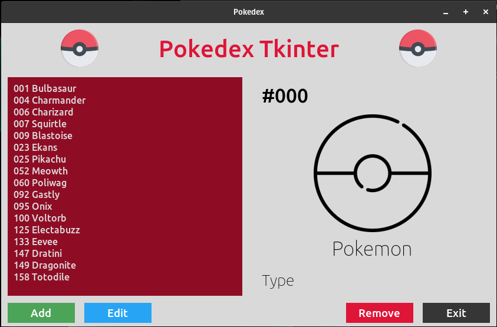

# Pokedex Tkinter

## Índice

- [Descrição]
- [Status do Projeto]
- [Funcionalidades]
- [Acesso ao projeto]
- [Tecnologias Utilizadas]
- [Pessoas Contribuidoras]
- [Conclusão]

## Descrição

*Pokedex Tkinter* é uma ferramenta com interface nativa em S.O. desenvolvida a partir de uma biblioteca Python (Tkinter). Esse projeto foi desenvolvido para enriquecer os conhecimentos de desenvolvimento Python, juntamente com a conexão com o MySQL. A ideia inicial era evitar um grande período desenvolvendo a interface, dando ênfase no objetivo real do projeto. Feito em Janeiro de 2023.

## Status do Projeto

O projeto encontra-se finalizado.

## Funcionalidades

O projeto trabalha com o conceito CRUD, tendo consistência direta com as operações do banco de dados. Então, no aplicativo, é possível adicionar, editar, deletar e visualizar informações sobre pokemons.

## Acesso ao projeto

Ações Necessárias:
- Instalar a biblioteca Tkinter e suas dependências;
- Instalar o banco de dados MySQL;
- Importar base de dados do banco de dados MySQL (dump.sql);

Para executar o projeto, execute o arquivo "app.py"

## Tecnologias Utilizadas

#Python | #MySQL | #Tkinter

## Pessoas Contribuidors

Pedro Rampazo - Criador e desenvolvedor do projeto

## Conclusão

Esse projeto forneceu uma grande evolução para visualizar como é feita a conexão entre uma aplicação e um banco de dados. Além disso, a solução que o Tkinter fornece é uma excelente ferramenta para quem não quer focar muito no frontend de um projeto, apenas focar no desenvolvimento do backend.
